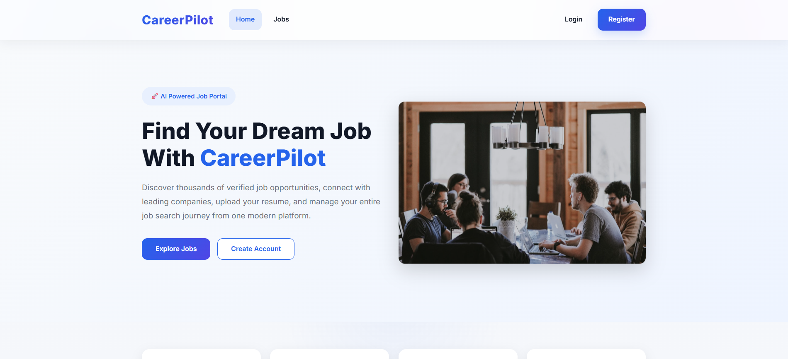

# 🚀 CareerPilot Frontend

A modern and responsive job portal frontend built with **React** and **Vite**. CareerPilot helps job seekers discover opportunities, manage applications, and interact with a secure Spring Boot backend through REST APIs.



---

## 🌟 Features

- 🔐 User Registration & Login
- 👤 Secure JWT Authentication
- 🏠 Modern Landing Page
- 🔍 Browse Available Jobs
- 📄 Resume Upload Support
- 💼 Apply for Jobs
- ❤️ Save Jobs
- 👤 User Profile Management
- 📱 Responsive Design
- 🔗 REST API Integration with Spring Boot Backend

---

## 🛠️ Tech Stack

| Technology | Purpose |
|------------|---------|
| React | Frontend Framework |
| Vite | Build Tool |
| React Router | Client-side Routing |
| Axios | API Communication |
| HTML5 | Structure |
| CSS3 | Styling |
| JavaScript (ES6+) | Application Logic |

---

## 📂 Project Structure

```text
CareerPilot-Frontend
│
├── public/
├── screenshots/
│   └── home-page.png
├── src/
│   ├── api/
│   ├── assets/
│   ├── components/
│   ├── pages/
│   ├── services/
│   ├── context/
│   ├── hooks/
│   └── App.jsx
│
├── .env.development
├── .env.production
├── package.json
└── README.md
```

---

## ⚙️ Getting Started

### Clone the Repository

```bash
git clone https://github.com/raghu777-ra/CareerPilot-Frontend.git
```

### Navigate to Project

```bash
cd CareerPilot-Frontend
```

### Install Dependencies

```bash
npm install
```

### Run Development Server

```bash
npm run dev
```

The application will start on:

```
http://localhost:5173
```

---

## 🌐 Backend API

Production Backend

```
https://careerpilot-jtkb.onrender.com
```

Swagger Documentation

```
https://careerpilot-jtkb.onrender.com/swagger-ui/index.html
```

---

## 📸 Application Preview

### Home Page


---

## 🔗 Related Repository

Backend Repository

https://github.com/raghu777-ra/careerpilot

---

## 👨‍💻 Author

**Raghu Math**

GitHub:
https://github.com/raghu777-ra

---

## 📄 License

This project is created for learning, portfolio, and interview demonstration purposes.